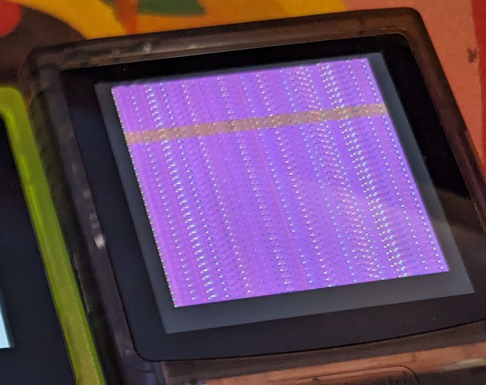

# Hardware Version 1.1

> [!CAUTION]
> THIS SECTION OF THE REPOSITORY IS ONLY FOR V1.1 HARDWARE. If you have have V1.0 or older, this firmware will NOT work on your device. 

[New v1.06 firmware!](2024.2.7/patched_bootlogo) for v1.1 hardware 

New on v1.1 (compared to v1.0)
* More accurate clock speed
* Faster charging (500mA -> 1A)
* Updateable on macOS

New on v1.11 (compared to v1.1)
* Speaker resistor value changed to 150k instead of 51k. Unknown effect.
* Two new caps near USB port. Unknown effect. 
 
## Updating

Instructions on this process in video linked above; [skip to the thirty nine minute mark.](https://youtu.be/YM7wYx_SsRY&t=2341)

To update: 
* On your Windows or mac PC, download the firmware "update.bin" file from this repository or funnyplaying's google drive links
* Firmware update **must** be named "update.bin". You cannot rename after copying.
* Switch FPGA GBC on with no game inserted
* Plug console into PC via USB Type C data cable (USB 2.0 is fine but USB 3.0 or USB Type C host type cables should also work)
* Copy "update.bin" file over to 1MB "FUNNY_PLAY_" file system
* Device will begin the update immediately while file copies
* Once copy is completed and device reboots, the update is completed

Occasionally, the saved display profile is corrupt and the console will display a garbled screen image on boot after updating to a different firmware version. 

To fix this, you need to blindly modify the settings. Try the following keypresses to save defaults and reset the console -- display should be usable from there. This is known to occur for users updating from 0.90 to 1.02 on v1.1 hardware and from 0928 or earlier builds to 1005 and later builds on v1.0 hardware. 

|  | Reset Corrupt OSD settings  <ol><li>Open OSD</li><li>Press down on dpad 9 times</li><li>Press A</li><li>Press up on dpad 1 time</li><li>Press A</li></ol>  [(credit: HDR)](https://twitter.com/MartinRefseth) |
| :---: | :--- |

Note that [debouncing](https://www.techtarget.com/whatis/definition/debouncing) does not appear to be implemented for OSD controls in some firmware versions so this may take several attempts. Without debouncing, one button press could be interpreted as two or more by the system. Try power cycling the console between attempts to reset to a known state. 

# Version Notes: *work in progress*

These firmware files have been provided to me via Funnyplaying directly and published with their permission. I have not coded, compiled, or had any involvement on the technical side here. 

> Quotes

are from funnyplaying directly, 

* bullet points are me paraphrasing.

**New!** Now ordered from newest to oldest like it should have been from the start.

### [2024.2.7](2024.2.7)
* Version 1.06 in the menu
* Lowered minimum volume
* Fixed OSD transparency
* Fixed sprites error in *Pokemon Puzzle Challenge*
* Fixed issue with multiplayer in *Pinball - Revenge of the Gator*
* I have included a [version with a patched bootloader](2024.2.7/patched_bootlogo) for a different aesthetic

### [2024.1.25](2024.1.25)
* Version 1.04 in the menu
> 1. Reoptimized OSD architecture
> 2. Added support for EverDrive GB Model 17, Rev E's support
> 3. Optimized the layout of the startup logo

### [2024.1.8](2024.1.8)
* Version 1.02 in the menu (same as above)
> 1. Modifying the startup logo
> 2. Partially removed GB mode color palette
> 3. Stability optimization

### [2024.1](2024.1)
* Version 1.02 in the menu
* Unknown changes over v0.9
* This release is unstable and not recommended for flashing

### Unknown Build
* Version 0.9 in the menu
* Initial firmware on v1.1 hardware revisions
* Unknown changes